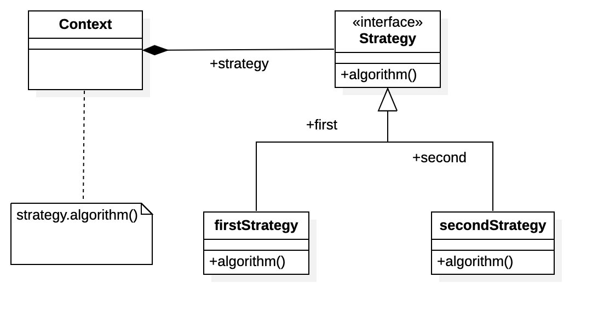
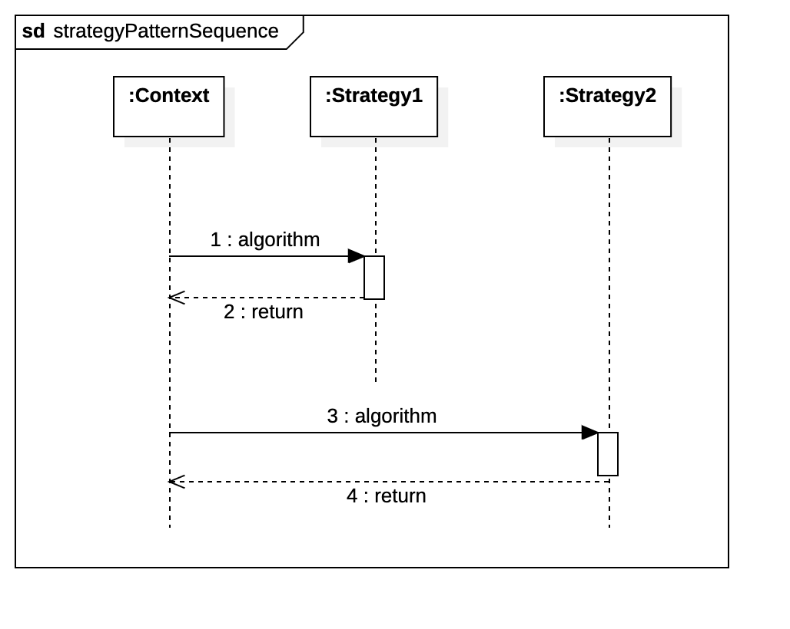
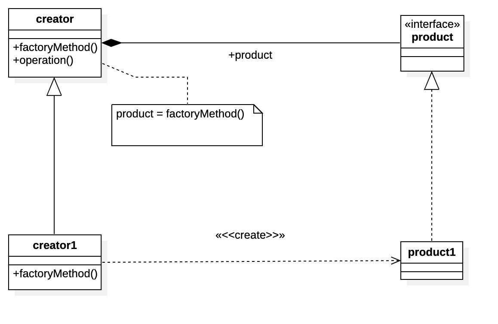
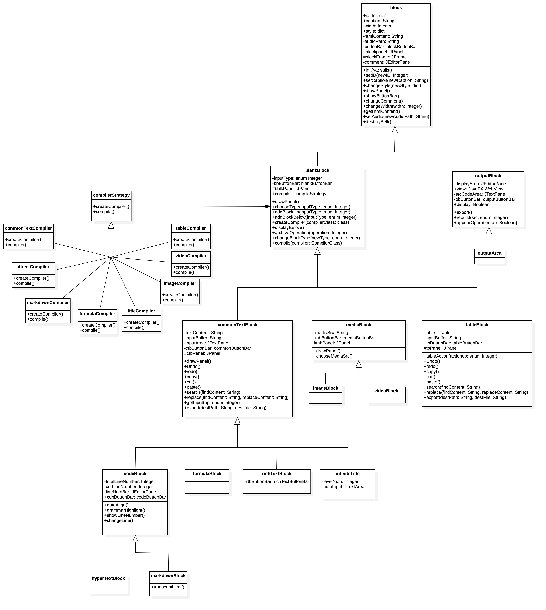
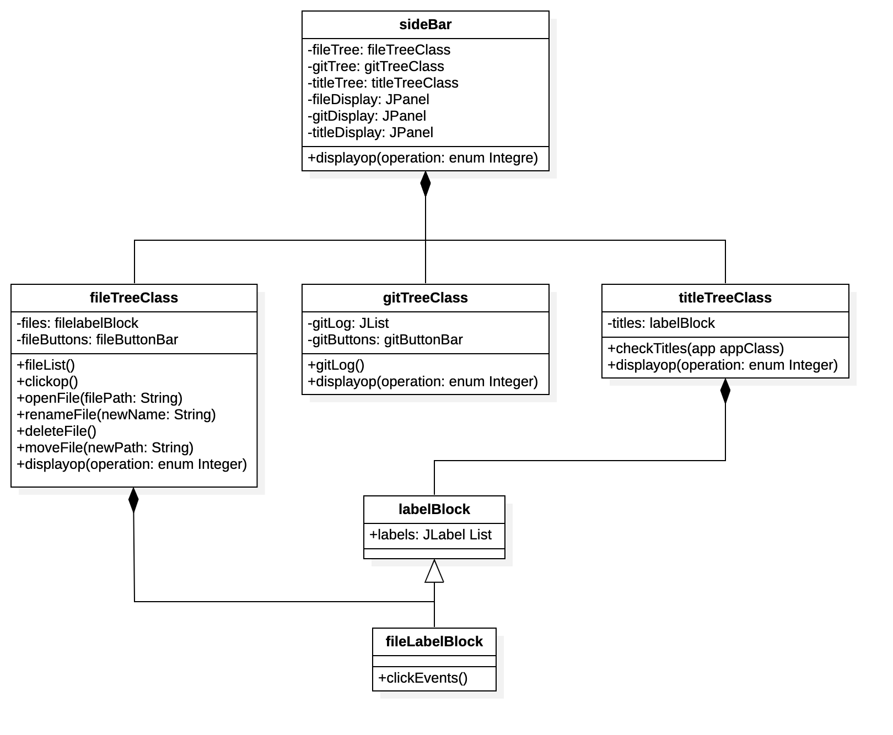

# Infinite NoteBook

author & developer: 高梓源	stu. Num: 2019K8009929026	university: UCAS

---

## Project Summary

本项目旨在制作一个可以支持任何内容输入且功能完全的笔记/便签应用，借鉴Jupyter NoteBook的设计特点，采用块结构容纳每种输入，并*push it to the new height*，极大扩展了输入内容的种类。针对不同的输入统一转换为`HTML/CSS`进行显示。由于时间原因，将大量使用Java现有的库和工具包（比如javaFX.WebView，JtextPane等组件），而不会自己完全制作车轮（比如webEngine和富文本编辑显示组件）。

    
    <figcaption style="color:grey;">图1. vscode + Jupyter NoteBook效果图</figcaption>
  </figure>

## Function Description

### Input type

输入块将陆续实现以下支持输入：

- [x] 普通文本
- [ ] 富文本，可以使用如下功能进行格式编辑
	- [ ] 文字
    - [ ] 字体选择、字号选择
    - [ ] 角标（上下左右）
    - [ ] 框选
    - [ ] 加粗、倾斜、下划线、删除线
    - [ ] 文字加颜色，文字加带颜色的背景
	- [ ] 段落
    - [ ] 居中、左右对齐
    - [ ] 行距、首行缩进
- [ ] markdown
- [ ] 超文本，可以直接编写`html`
- [ ] 无限级标题
- [ ] 其他文本类
	- [ ] 代码，语法高亮使用[Google code prettify](https://github.com/googlearchive/code-prettify)
	- [ ] 公式
	- [ ] 表格
- [ ] 多媒体
	- [ ] 图片插入
	- [ ] 视频嵌入
	- [ ] 音频嵌入
- [ ] 自定格式分隔符
	- [ ] 横线，粗细，长短，颜色，线条样式
	- [ ] 空白，可通过设置块大小设置区域南北长度

考虑实现智能的填充推荐，比如分段和代码的自动缩进

### Menubar

类似其他应用，在菜单栏将实现基本的文档操作，但是本应用将采用两种工作区模式：内部工作区模式，和外部文件夹工作区模式。

- 每次应用打开时，默认采用内部工作区模式，所有文件在应用所在文件夹中被管理，初步想法是只有在该模式下才能与云端同步，直接使用`git`远程平台进行存储等版本管理操作。
- 如果选择工作区文件夹打开应用，则在目标文件夹进行文档操作

菜单栏将实现如下操作，打开、删除文件及`git`本地提交显示等操作将在之后的Side Bar实现。

- 工作区及文件整体操作
	- [ ] 打开新窗口
		- 打开新的**Infinite NoteBook**窗口
	- [ ] 保存
		- 新创格式`.ing`，将会保存每个块中用户的输入内容，注意多媒体类将保存路径，保存过后，用户不应对其路径有改变。保存一次过后将会默认保存至此路径对应文件
		- 保存过后自动利用`git`进行操作及时为用户保存必要信息
	- [ ] 另存为
		- 打开新的路径进行保存，注意新路径并不会成为默认保存路径，改变默认保存路径必须删除原先保存的文件
	- [ ] 导入
		- [ ] 其他的`.ing`文件
		- [ ] 任意路径的`txt`文件
		- [ ] 任意路径的`doc/docx`文件
		- [ ] 任意路径的`xlsx/csv`文件
		- [ ] 任意路径的多媒体文件，直接拷贝到项目文件夹而后引用
	- [ ] 导出
		- 导出当前文档为`html`
	- [ ] 关闭应用
- 文件编辑操作
	- *若某一模块被激活，则对该模块兼上操作，即添加块在当前块上方*
	- *否则对文档末尾操作*
	- [ ] 剪切块
	- [ ] 复制块
	- [ ] 粘贴块
	- [ ] 添加输入块
	- [ ] 删除块
	- [ ] 查找所有文本
	- [ ] 替换
- [ ] 云端操作（远程，precisely）
	- [ ] 仓库操作
		- [ ] 新窗口，可添加新远程空仓库/同步或更落后commit仓库，改变或删除现有仓库，但远程至少有一个才能解锁下方操作
		- [ ] 更该用户信息
	- [ ] 拉取
		- pull操作，拉取远程分支变化的commit
	- [ ] 推送
		- push操作，推送到远程分支
- 设置
	- [ ] 外观，新窗口内选择App字体、字号，背景

### Side Bar

- [ ] 展示当前文件树
- [ ] git版本提交信息
- [ ] 由无限级标题和块结构名称/摘要构成的大纲

### Top Bar

- [ ] 文件标签页
- [ ] 允许分屏

### Input Block（输入块）

输入块有以下种类：

- 普通文本块
- 富文本块
- markdown块
- 超文本块
- 无限级标题块
- 代码块
- 表格块
- 图片块
- 视频块

输入块将允许一下操作：

- [ ] 统一操作
  - [ ] 选择输入块输入种类
  - [ ] 改变南北宽度
  - [ ] 构建当前块
  - [ ] 添加输入块，在下方或上方
  - [ ] 删除当前块
  - [ ] 插入音频
  - [ ] 构建`html`，提供源码和阅览两种模式
  - [ ] 更改`html`，但下次构建仍然按照原先格式
  - [ ] Archive/UnArchive块，暂时封存块，构建保存`html`格式，下次构建将跳过此块，按照保存的格式使用
- [ ] 文本/表格块编辑专用操作
	- [ ] 撤销
	- [ ] 重做
	- [ ] 剪切
	- [ ] 复制
	- [ ] 粘贴
	- [ ] 查找（高亮所有结果）
	- [ ] 替换（首个、全部）
  - [ ] 导出当前块
- [ ] 图像、视频块编辑操作
	- [ ] 选择插入源

### Display Block/Area（输出块/区）

输出区可以观看已经构建块的样式，有两种模式，代码模式和阅览模式，代码模式可以读取整个文本的`html`，阅览模式则启动web Engine，进行展示和渲染，和浏览器与markdown编辑器。

输出区分为两种，当在输入块点击构建并显示，则在输入块下方显示对应的输出块。

当在全局菜单选择构建并显示，则在大块输出区。

## Demand Analysis and Model

针对需求，查找资料后决定大肆使用JTextPane和JTextArea组件，GUI组件可能比较着混合使用Java Swing与Java AWT。

针对一些可复用的属性和方法，为类之间确定层次关系，提取共性特征，大量使用类继承操作；此外，因为每个类会有相同名称的方法但是实现又有所差别，咨询助教后决定采用策略模式(Strategy Pattern)和工厂方法模式(Factory method pattern)，将方法抽象为类，在运行创建子类的时候选择采用何种方法，并且将类的创建延迟到子类调用函数。

|类图|时序图|
|:-:|:-:|
||
|图2. 设计模式类图表示|图3. 设计模式时序图表示|

    
    <figcaption style="color:grey;">图4. 工厂方法模式UML类图设计</figcaption>
  </figure>

### 输入输出块类设计

- 输入输出块区的共同基类：`block`，输入块的*“准基类”*可以看作`blankBlock`，具有填充空白的效果，空白与该块等高
  - 输入块中普通文本块、多媒体块、表格块继承自此
    - 而代码块、公式块、无限级标题块、富文本块继承自普通文本块，由于超文本块、markdown块和代码块只是标签选项、构建模式不同，令超文本块继承（拷贝）自代码块即可。其余块分别添加不同的功能，最后一个类需要单独使用转换方法，将markdown转换为`html`，图像和视频块继承自多媒体块
  - 输出块的阅览模式使用javaFX.WebView，调用现成的Java Web Engine实现对本地html/CSS/JS的渲染和显示，而源码模式直接使用TextArea即可
  - 事实上输出区可看作大一些的输出块，因此也可继承自输出块

UML类图如下所示：

    
    <figcaption style="color:grey;">图5. 输入输出块UML类图设计</figcaption>
  </figure>

其中编译器(compiler)模块的创建和编译算法的使用利用到了工厂方法模式和策略模式。

### Button Bar类

为需要集成多个按钮的部件配备button Bar，例如在输入输出块实现块的操作，不同块共同的基类为`blockButtonBar`，输入块的*“准基类”*为`blankButtonBar`负责完成输入块的统一操作。而文本类和复杂、其他文本类所享有的Button Bar从基类extends，添加各类文本输入块专有功能。简单的方法是直接寻访输入块的方法。

它们通过集成`JButton`和相应操作与弹出选项实现输入输出块的相应功能，这一组类会包含于输入输出块类中，即为`composition`关系。

在`sideBar`类中的文件树、git版本显示操作、`menuBar`类大三大类操作中也需要集成按钮，可以使用该类进行设计。

该类还包含下拉列表和右键操作功能。

### sideBar类

按照需求，需要包含三个类，文件树类、git版本类、大纲类，UML设计如下：

    
    <figcaption style="color:grey;">图6. SideBar类UML类图设计</figcaption>
  </figure>

### menuBar类

同样可以拆分成三个类，`workSpace`类、`fileEditor`类、`gitRemote`类对应实现三大类功能，因为大都是使用函数调用的方式进行操作，在此不做展示。

以上所有类基于`App`基类进行调用和统一展示。

## Operation Process

主要按照App启动的过程叙述上述类图设计中对象加载的过程：

1. 首先App启动，顶层`App`类会加载整个`JFrame`，运行加载函数实例化各个类，完成`sideBar, menuBar`实现，并且在屏幕左边初始化一个`blankBlock`供用户选择输入类型，右半屏幕将会有空白的`outputBlock`
2. App中也会有一个`BlockManager`类对象站在全局视角统一管理各种`block`，同时为各种函数和监听事件提供对象
3. 用户点击`blankBlock`集成按钮中的操作会完成对应功能，例如在下方插入块等，即在此函数中实例化块并且加入全局的块列表统一管理
4. 若进行删除块将会在全局的管理模块中也异步删除，因为考虑到撤销活动，在很多操作的实现需要缓冲区(Buffer)
5. 用户使用构建功能会记录下本块的编译信息，需要整体构建才能够在输出区进行显示
6. 对于menuBar中的操作也会站在全局管理的视角整体操作

## Engineering Schedule

因为时间的紧迫性，严格按照`KISS`原则进行设计实现，那么按照任务优先级进行以下排序：

- [ ] `Block`各种类设计实现
  - [ ] 完成各种输入到`html`的转化，即编译器的实现
  - [ ] 完成`buttonBar`设计实现
  - [ ] 完成输出、导入导出、存取、剪贴板、搜索相关基本操作
- [ ] 初步设计GUI界面，显示`Block`
- [ ] 完成`menuBar`各功能并加入GUI界面
- [ ] 完成文件树、大纲显示并加入GUI界面
- [ ] GUI界面初步美化
- [ ] 完成`git`嵌入，实现`git log`在`sideBar`和`menu`中的实现和使用
- [ ] GUI界面完全美化