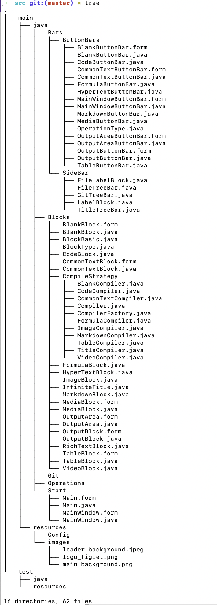
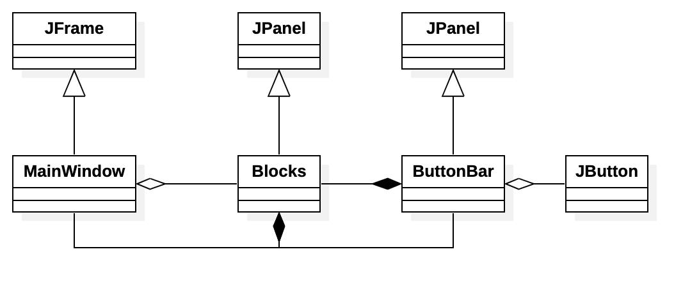
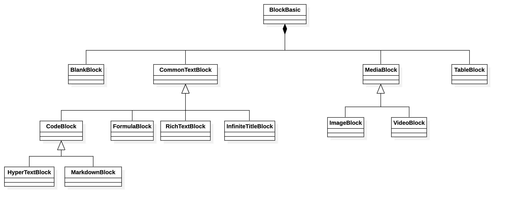
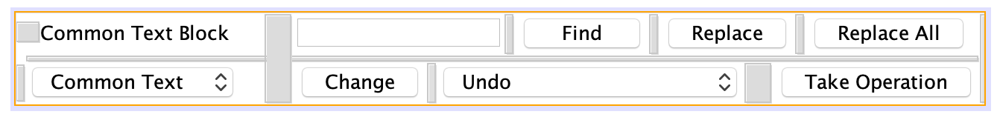
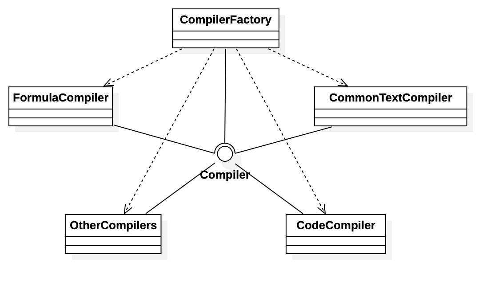

# Infinite NoteBook - Project Design Report

author & developer: 高梓源	stu. Num: 2019K8009929026	university: UCAS

---

## Summary / Frontier

经过此前老师的一些点评和自己对于java和设计模式更加深入的理解，参考[阿里巴巴Java开发手册](https://github.com/alibaba/p3c)，修正了java相关写法（比如类首字母也大写），对于项目原先的设计等做了调整，并且实现了大体框架，实现的内容将逐步在`Project_Assignment1`的需求中勾选。本次设计使用了并不好看但是特别实用、内容丰富的`Apache Netbeans`编辑器，虽然`IDEA`贴近审美，但是做`GUI`界面所需的组建和布局管理器`layout manager`可提供的太少，制作`form`并不是很方便，*华而不实*。不选择`eclipse windows designer`的原因是`eclipse`在笔者Intel Mac上表现非常不稳定，经常会报出error。

先是一张`src`主要文件图：

<center>
  <figure>
    
    <figcaption style="color:grey;">图1. src主要文件树</figcaption>
  </figure>
</center>

## File Description

如上图所示，由`gradle`生成的项目文件位于`main`和`test`目录下，在`main/java`中编写源码，在`main/resources`中放置项目所需要的资源文件。

本着抽象和聚类的文件管理思想，将同一类的文件打包，每个文件名都是相应的（枚举）类或接口名称，项目看起来还是略微有些庞大，但事实上运用了很多类继承和组合等设计之后，只需要对部分文件进行设计，其余文件只需要进行少部分的覆盖重写即可。

项目文件主要分为

- `Start`包：由两个继承自`JFrame`的类组成，为主要向用户展示的界面
- `Blocks`包：由各种输入输出块组成，块共同基类为`JPanel`，相当于在`JFrame`上绘制的面板，最终将在`MainWindow`界面中
	- `Blocks.CompileStrategy`包，这部分是运用工厂模式写成的适配于各种`block`的编译器，将为他们生成对应html代码
- `Bars`
	- `Bars.ButtonBars`包，包含适配`MainWindow`和各种`Blocks`包的按钮操作块，运用了很多继承关系，共同的基类是`JPanel`，最终将在`Blocks`的面板中显示，并且`click`等接口将触发`Blocks`块的函数，来响应完成对应操作
	- `Bars.SideBar`包，包含显示在侧边栏的文件/大纲/Git目录

主要逻辑的UML类图如下：

<center>
  <figure>
    
    <figcaption style="color:grey;">图2. 主要逻辑块UML图</figcaption>
  </figure>
</center>

双向组合的目的在于生成的类需要安排时间响应，直接调用自己的方法是最好的选择。

对于这个问题，一开始没有意识到这种简单做法，想的只是如何实现组合关系的类之间进行消息通讯。于是笔者研究和尝试了观察者模式，初步想法是对组成类值的改变设置监听器，让个体去针对监听器响应调用相应函数，这方面`java.util.Observer`有一个现成的解决方法，但是早在java 9中这个类就被弃用`deprecated`，因为它*not serializable, not thread safety*；替代方式`java.beans.PropertyChangeListener`，但是仍然较为繁复，毕竟需要两层的事件响应。后来才发现只需要在子类中能够引用父类方法，在事件响应时直接调用即可。

## Start-up Design

启动程序将先加载`login`界面，输入一次密码之后将会自动记住，以后再考虑更加安全可靠的设计，不过希望拥有一个启动缓冲，后期可能加入打开`project`的方式

而后加载主窗口，如需求分析所述，采用块结构组织各种输入。使用聚合的逻辑将各个块统一组织到相应的`ArrayList`中，而后赋予他们唯一的递增下标`index`，对应他们的显示顺序，再组织一个`ArrayList`标识每一个显示块的类型，这样方便更快地查找对应块。此处就可以使用`enum`类似C语言的方便操作。

## Block Design

对于块的设计相较此前[需求分析](https://github.com/ETOgaosion/OOP_course/blob/master/Project_Assignment1/project_description.md)有些改变，正如Wang老师所述，滥用继承是不可取的，Composition Over Inheritance是一种解决办法，于是笔者将`block`顶层块修改为`BlockBasic`，且与其他块的关系重新设计为组合`Composition`，并且将其他块的共性继续提取、整合，放在这一个顶层`class`中，它本身不承担任何GUI的显示，而是充当数据和方法的提供商。

虽然事实上是可以用继承去完成每种功能块的，但是会涉及到隐藏/取消父类的组件，并不推荐使用继承关系去实现；而且用代码实现GUI布局还要费时间调试，因此考虑设计时限的问题遵循KISS法则，笔者将`BlankBlock/CommonTextBlock/MediaBlock/TableBlock`分拆开来设计，每一个使用`netbeans`单独绘制`form`。**这是合理的**，因为一旦按照前述将`BlockBasic`抽象出来，使用组合关系供这些块使用后，他们之间的其余联系就不剩多少了，甚至说差异相当之大，因此单独拆分是符合工程学考虑的。

而要涉及到输入的块还按照此前的说法，将它们归结到`CommonTextBlock`，这部分共性还是相当大的，他们完全可以只是编译器和块名称不同，其余输入都相同（类似代码编辑器的统一风格）。

于是修正后的UML类图如下：

<center>
  <figure>
    
    <figcaption style="color:grey;">图3. 块结构UML图</figcaption>
  </figure>
</center>

### BlockButtonBar Design

这部分主要是GUI的绘制，也是考虑到设计时限的问题，采用了简单的实现方法，在最终的设计里会实现全窗口编辑模式和半窗口半预览以及侧边栏显示的模式，这就导致GUI的排布不能按照最理想情况进行，有两种解决办法：

- 动态调整，因为GUI组件的移动调整费时费力，今后项目重构/优化的时候可以考虑
- 按照最坏情况设计，将按钮块组件按照最窄情况排布，于是不需要动态调整内部内容，只需要更换显示范围

这里按照方案二设计，并且又做了*创新*，为了在极其有限的区域内集成很多操作，使用了下拉选框。在按钮点击事件中，由于使用组合关系可以引用调用者，因此只需要调用其相关函数进行相应操作。

这里在最初设计时，有过多线程的一些担忧，会否可能多个线程同时触发一个操作，而等到调用者进行响应的时候看到的已经是另外线程的数据，非原子操作会产生不对应的错误。认为在类中`public`操作改变变量的时候最好都带上锁以保证原子性（不知是否正确，欢迎评论指正）。

<center>
  <figure>
    
    <figcaption style="color:grey;">图4. BlockButtonBar GUI设计</figcaption>
  </figure>
</center>

回到调用者Block，对于响应操作进行填写，比较优雅和无忧的方式是直接使用组件中包含的现成方法，比如剪贴板操作、`undo`和`redo`操作，可以直接利用`java.swing`提供的`Manager`：

```java

import javax.swing.undo.UndoManager;
import javax.swing.event.UndoableEditEvent;
import javax.swing.event.UndoableEditListener;

		private UndoManager undoManager = new UndoManager();
		// usage:
		private void initUndoManager(){
        mainInputTextPane.getDocument().addUndoableEditListener(
        new UndoableEditListener(){
            public void undoableEditHappened(UndoableEditEvent e){
                undoManager.addEdit(e.getEdit());
            }
        });
    public boolean whetherCanUndo(){
        return undoManager.canUndo();
    }
    public boolean whetherCanRedo(){
        return undoManager.canRedo();
    }
    public boolean undoOperation(){
        if(!undoManager.canUndo()){
            return false;
        }
        undoManager.undo();
        return true;
    }
    public boolean redoOperation(){
        if(!undoManager.canRedo()){
            return false;
        }
        undoManager.redo();
        return true;
    }
```

文本编辑器本身逻辑实现较为简单，便不一一列举。

## Compiler Factory

在理解了工厂模式之后发现其方便性，主要可以应用在同一方法不同实现的需求中，而这里对不同块采用不同的编译`compile`策略正是满足这种属性。

于是参考[tutorialspoint](https://www.tutorialspoint.com/design_pattern/factory_pattern.htm)这篇指导，首先设计名为`Compiler`的接口`interface`，而后有不同的编译策略覆盖实现`implement`这一接口，接下来`CompilerFactory`类通过外界输入的编译类型生成对应的编译策略，并且运用多态，**面向接口编程**，外界输入同样使用`enum`枚举来限定和简化。

<center>
  <figure>
    
    <figcaption style="color:grey;">图5. 工厂模式实现编译器UML图</figcaption>
  </figure>
</center>

具体的编译器设计是算法问题，只需要将输入内容按行分析，符合一定语法规则我们按照html规范将其改造，输出合法html String。

