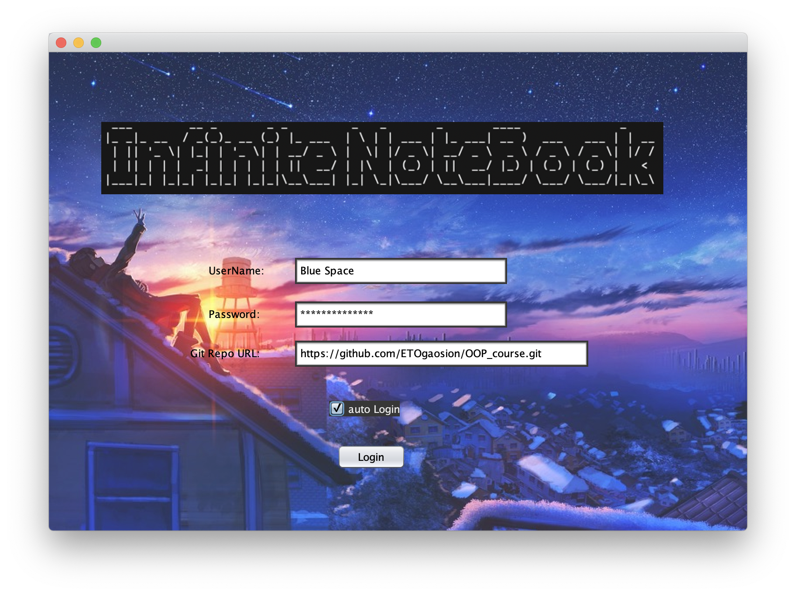
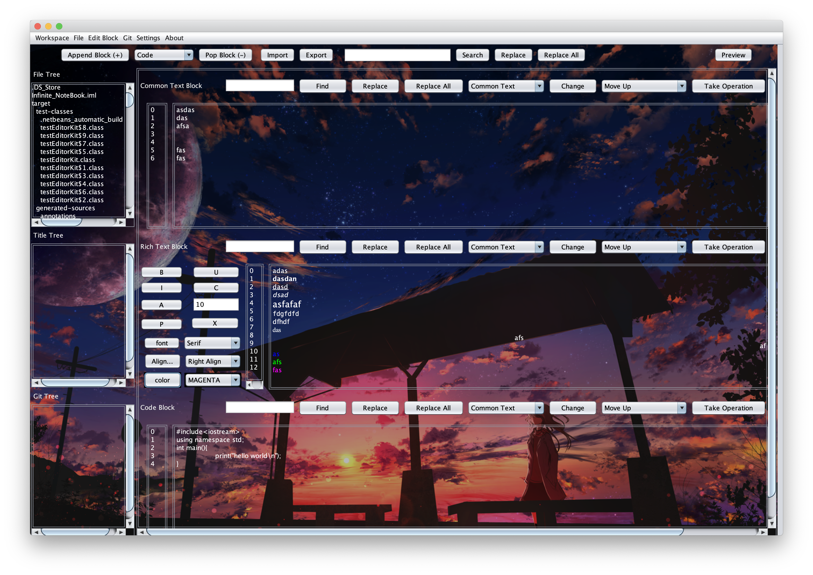
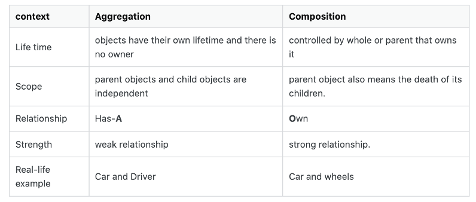
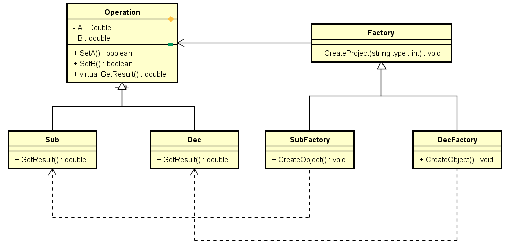
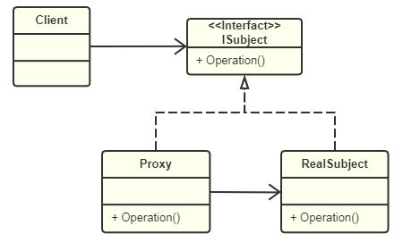
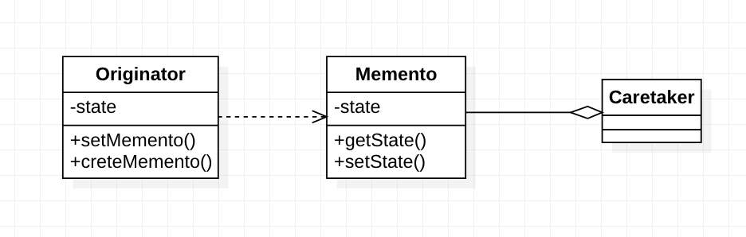
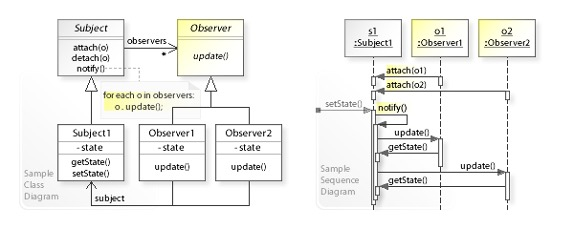

# Infinite NoteBook - Project Design Report

author & developer: 高梓源	stu. Num: 2019K8009929026	university: UCAS

---

## distinctiveness

### 想法源头

- 一般的编辑器，共同点：一个文本输入块，一个文件格式
	- Vscode, Nova, Sublime Text, Xcode
	- JetBrains, Netbeans, VS, Android Studio
	- Latex, Word, Markdown
- Jupyter NoteBook: 多个文本输入块，多种输入格式
  - 代码：支持多种语言，选择适当内核可运行并输出，主要以python为主
  - Markdown

## developing environment

- Project Manager:
	- Maven (switch from Gradle)
- IDE:
	- Apache netbeans: Coding & Drawing GUI
		- Light-Weight
		- Full-Featured: Layout Manager Free-Design
	- IntelliJ IDEA: Download External Library with Maven & UML Diagram
- GUI Lib:
	- Java swing & awt
	- (javaFx if only I know earlier)

## Product overview

v0.0.1 Beta

  <figure>
    
    <figcaption style="color:grey;">图1. 登陆界面</figcaption>
  </figure>

  <figure>
    
    <figcaption style="color:grey;">图2. 主界面</figcaption>
  </figure>

## Advanced design pattern

### Feature extraction & use of relation & Parent/interface oriented program

项目中类似的类：

- Buttons
- Input Areas
- Blocks: Input, Media

So Avoid repetition.

是否使用继承？

是否愿意接受父类的所有私有方法

如[wiki](https://en.wikipedia.org/wiki/Composition_over_inheritance)所述，Composition_over_inheritance

组合能够将类的共性提取出来，也是避免重复的绝佳手段，如果继承关系不强烈可使用组合。

若确实需要使用继承，注意面向父类编程，以简化代码（只需要维护父类），父子继承相当于`if`条件或函数参数进行分支选择算法

组合(Composition)和聚合(Aggregation)的强度不同，区别如下所示

  <figure>
    
    <figcaption style="color:grey;">图3. Aggregation VS Composition</figcaption>
  </figure>

### (abstract) Factory pattern

- Compiler
- Blocks
- ButtonBars

都是功能类似，算法等属性略微不同，可使用工厂模式生产，这样后续维护或添加的时候会方便很多，无需改动旧有代码，只需添加。

  <figure>
    
    <figcaption style="color:grey;">图4. FactoryPattern UML</figcaption>
  </figure>

### iterator pattern

迭代器模式，隐藏迭代对象的具体实现，在使用多对一聚合关系的时候使用很方便，例如主界面包含多个Block，需要全局查找的时候可以使用迭代器模式遍历Block的ArrayList。

  <figure>
    
    <figcaption style="color:grey;">图5. IteratorPattern UML</figcaption>
  </figure>

### proxy pattern

login点击后和编译选项激活后不会立即执行登陆和编译，会首先检查用户输入是否合法，而后调用对应对象的方法。

  <figure>
    
    <figcaption style="color:grey;">图6. ProxyPattern UML</figcaption>
  </figure>

###  Memento pattern

Redo/Undo Manager

  <figure>
    
    <figcaption style="color:grey;">图7. MementoPattern UML</figcaption>
  </figure>

### Observer pattern

GUI core: BUTTONs

Action, Event, Listener

User Action trigger out Events bound with Listener

  <figure>
    
    <figcaption style="color:grey;">图8. ObserverPattern UML</figcaption>
  </figure>

## Why is infinite

### Issues: feature requests

- This is framework, opensource + plugin mode lead to last-long development
- Original Demands & GUI perfection (or switch to JavaFX)
- Beautify html output?……

### A worry

Under High concurrency environment, trying to access an object from many others.(aggregation)

So need locks for every fields of object? Or a lock for an object? Or a queuer for an object?
